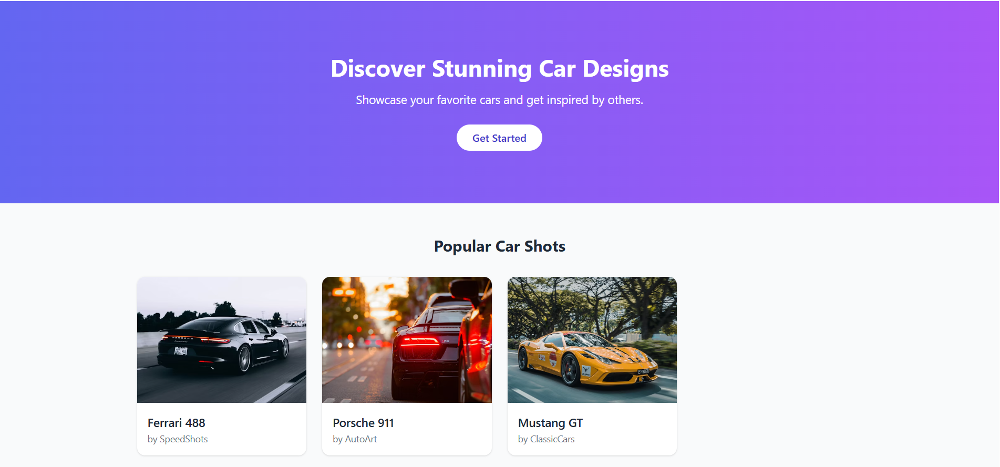

# Project Responsive Web Design using Bootstrap
## Date:15.10.2025

## AIM:
To create a simplified clone of Dribbble (https://dribbble.com/) landing page.


## DESIGN STEPS:

### Step 1:
Clone the repository from GitHub.

### Step 2:
Create Django Admin project.

### Step 3:
Create a New App under the Django Admin project.

### Step 4:
Insert the necessary CSS and JavaScript files as external in order to use Bootstrap.

### Step 5:
Create a HTML file and include the needed Bootstrap components.

### Step 6:
Publish the website in the LocalHost.

## PROGRAM :

```
<!DOCTYPE html>
<html lang="en">
<head>
  <meta charset="UTF-8" />
  <meta name="viewport" content="width=device-width, initial-scale=1.0" />
  <title>Carbbble - Explore Amazing Cars</title>
  <script src="https://cdn.tailwindcss.com"></script>
</head>
<body class="bg-gray-50 text-gray-800">

  <!-- Header -->
  <header class="flex items-center justify-between px-8 py-4 bg-white shadow-sm">
    <h1 class="text-2xl font-bold text-indigo-600">Carbbble</h1>
    <nav class="space-x-6 text-gray-600">
      <a href="#" class="hover:text-indigo-600">Explore</a>
      <a href="#" class="hover:text-indigo-600">Collections</a>
      <a href="#" class="hover:text-indigo-600">About</a>
    </nav>
    <button class="bg-indigo-600 text-white px-4 py-2 rounded-lg hover:bg-indigo-700">
      Sign In
    </button>
  </header>

  <!-- Hero Section -->
  <section class="text-center py-20 bg-gradient-to-r from-indigo-500 to-purple-500 text-white">
    <h2 class="text-4xl font-bold mb-4">Discover Stunning Car Designs</h2>
    <p class="text-lg mb-6">Showcase your favorite cars and get inspired by others.</p>
    <button class="bg-white text-indigo-700 px-6 py-2 rounded-full font-semibold hover:bg-gray-200">
      Get Started
    </button>
  </section>

  <!-- Car Grid -->
  <section class="max-w-6xl mx-auto px-6 py-12">
    <h3 class="text-2xl font-bold mb-8 text-center">Popular Car Shots</h3>

    <div class="grid gap-6 sm:grid-cols-2 md:grid-cols-3 lg:grid-cols-4">
      <!-- Card -->
      <div class="bg-white rounded-xl shadow hover:shadow-lg overflow-hidden">
        
        <div class="p-4">
          <h4 class="font-semibold text-lg">Ferrari 488</h4>
          <p class="text-sm text-gray-500">by SpeedShots</p>
        </div>
      </div>

      <div class="bg-white rounded-xl shadow hover:shadow-lg overflow-hidden">
        
        <div class="p-4">
          <h4 class="font-semibold text-lg">Porsche 911</h4>
          <p class="text-sm text-gray-500">by AutoArt</p>
        </div>
      </div>

      <div class="bg-white rounded-xl shadow hover:shadow-lg overflow-hidden">
        
        <div class="p-4">
          <h4 class="font-semibold text-lg">Mustang GT</h4>
          <p class="text-sm text-gray-500">by ClassicCars</p>
        </div>
      </div>
  </section>

  <!-- Footer -->
  <footer class="bg-gray-900 text-gray-400 text-center py-6 mt-12">
    <p>© 2025 Carbbble. Built with ❤️ for car enthusiasts.</p>
  </footer>
</body>
</html>

```

## OUTPUT:



## RESULT:
The Project for responsive web design using Bootstrap is completed successfully.
